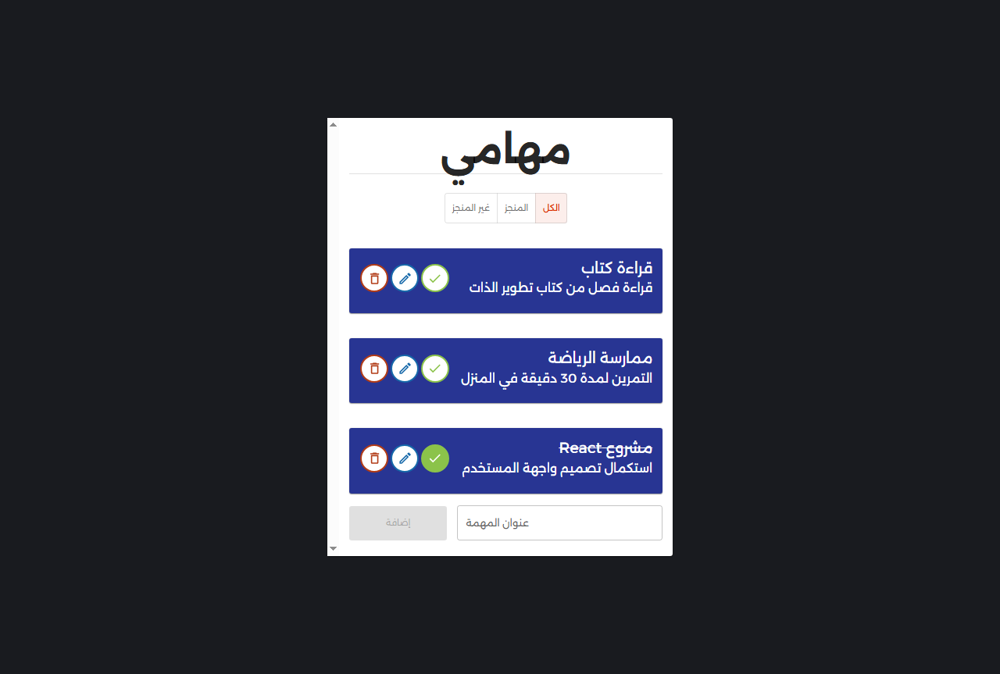
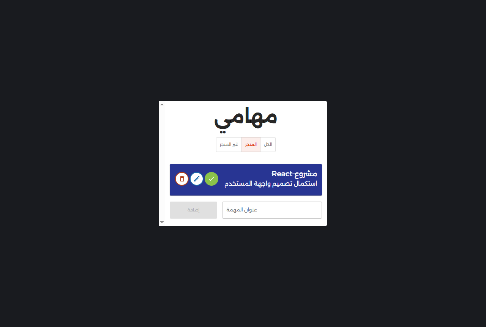
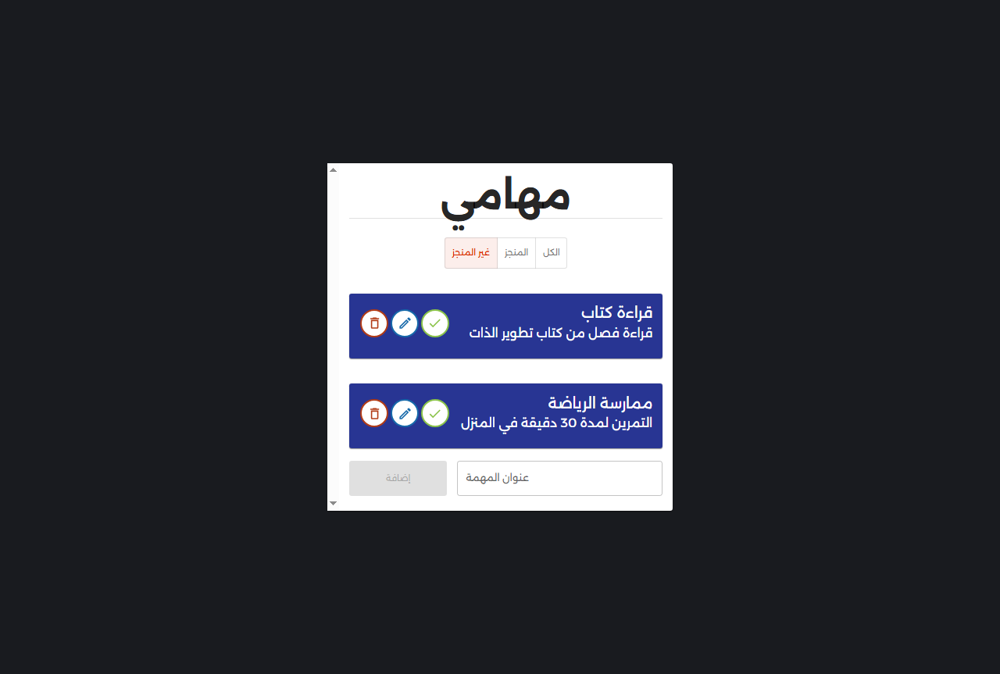
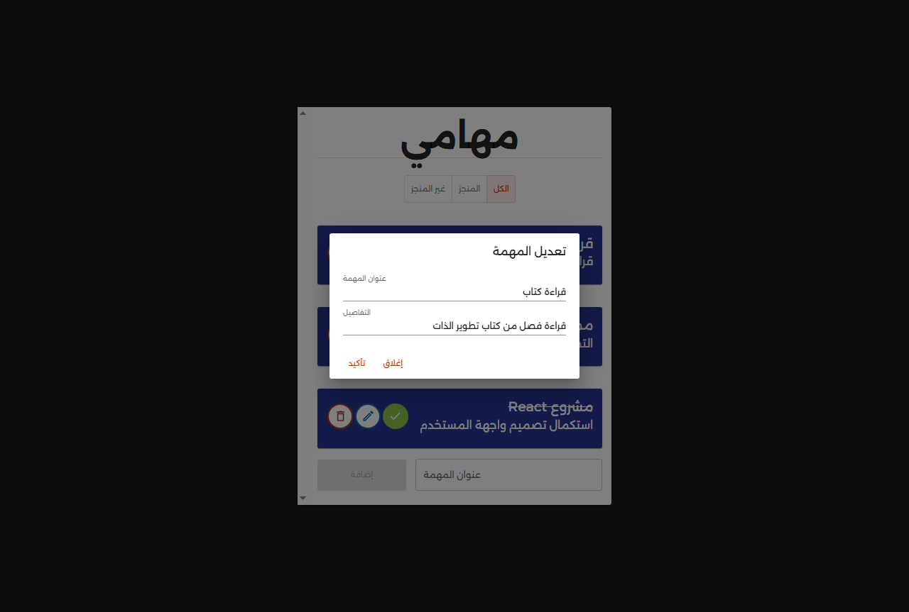
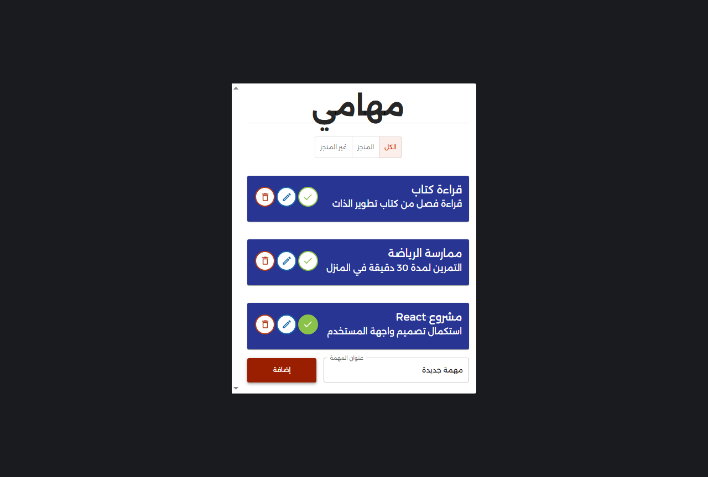
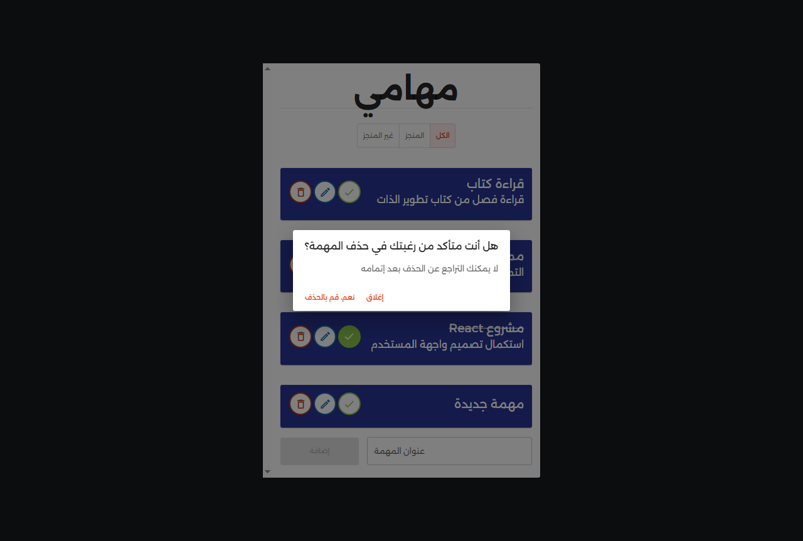

# 📋 todo-list-app

**A responsive and dynamic task management web application built with React, Vite, and Material UI.**

🎯 This is my **second official project after completing the React course** 💪  
🚀 From the Udemy course by Eng. **Yarob Al Mostafa** ([Tarmeez Academy](https://www.youtube.com/@tarmeez))

---

## 📖 Project Description

This project is a fully functional **To-Do List App** built using **React + Vite** and styled with **Material UI (MUI)**.  
It allows users to add, complete, edit, and delete tasks with real-time toast notifications.  
Tasks are persisted automatically using the browser's `localStorage`.

The app supports **Arabic RTL layout**, a custom Material UI theme (with **Alexandria** font), and a modular structure using custom **React Contexts**.

---

## ✅ Features

- 📝 Add new tasks with title & details  
- ✅ Mark tasks as completed with clear visual feedback  
- 📝 Edit tasks using a clean modal dialog  
- 🗑️ Delete tasks with confirmation prompts  
- 🔁 Filter tasks by all, completed, or not completed  
- 💾 Save tasks automatically to localStorage  
- 📢 Show toast messages (success/info) for task actions  
- 🧠 Global state management via custom React Contexts  
- 🌐 Right-to-left layout and full Arabic support  
- ⚡ Built with **Vite** for faster development & builds  
- 📱 Fully responsive UI using Material UI

---

## 🧠 React Concepts Used

| Concept                | Usage                                                   |
|------------------------|---------------------------------------------------------|
| `useState`             | Manage tasks, UI dialogs, and toast state               |
| `useContext`           | Share global task and toast state across components     |
| `useEffect`            | Load & sync tasks with localStorage                     |
| `UUID`                 | Generate unique task IDs                                |
| `Conditional Rendering`| Toggle dialogs, toast, and filters dynamically          |
| `React.forwardRef`     | Create reusable custom alert components                 |

---

## 🧰 Tools & Libraries

| Tool                 | Purpose                                           |
|----------------------|---------------------------------------------------|
| **React**            | Main framework for UI logic                       |
| **Vite**             | Fast development environment and bundler          |
| **Material UI (MUI)**| UI components, dialogs, and theming               |
| **UUID**             | Unique task IDs                                   |
| **Alexandria Font**  | Elegant Arabic typography                         |
| **Local Storage**    | Persistent storage for tasks                      |
| **MUI Snackbar/Alert**| Toast notifications for user actions             |
| **Custom Contexts**  | Modular state sharing across components           |

---

## 📸 Screenshots

### 🖥️ Desktop View  

  
  
  
  
  
  

---

## 📝 Notes

- ✅ This project was **completed on April 14, 2025**, and later enhanced in August 2025  
- 🧠 It's my **second project** after completing a full React course  
- 🛠️ Now powered by **Vite** for optimal development experience  
- 🧩 Enhanced with modular contexts for todos and toast management  
- 🚫 Project currently designed for localhost use (until deployed)

---

## 📚 Useful Links

### 🎓 Course & Instructor

- 📘 React Course on Udemy:  
  [https://www.udemy.com/course/tarmeezacademy-react/](https://www.udemy.com/course/tarmeezacademy-react/)

- 📺 Tarmeez Academy YouTube Channel:  
  [https://www.youtube.com/@tarmeez](https://www.youtube.com/@tarmeez)

- 👨‍💻 Eng. Yarob Al Mostafa on GitHub:  
  [https://github.com/Yarob50](https://github.com/Yarob50)

---

## 🙋‍♂️ About Me

- 📧 Email: [maher.elmair.dev@gmail.com](mailto:maher.elmair.dev@gmail.com)  
- 🔗 LinkedIn: [https://www.linkedin.com/in/maher-elmair-831042237](https://www.linkedin.com/in/maher-elmair-831042237)

---

## 🔗 Live Preview

🎥 **View the project live on GitHub Pages (or other host):**

🌐 [https://maher-elmair.github.io/Todo-List-App/](https://maher-elmair.github.io/Todo-List-App/)

> ⚠️ *Make sure to update the live URL if deploying via Vite or using a different host (e.g., Netlify or Vercel).*

---

## 🙌 Thank You

If you liked the project, please ⭐ the repository!  
Feel free to open issues or contribute with PRs — always appreciated 🙏
